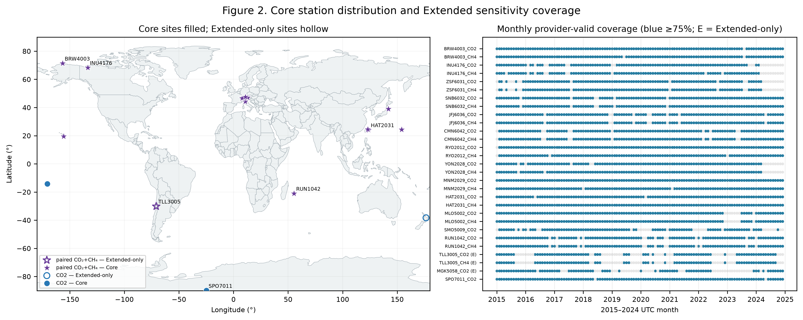
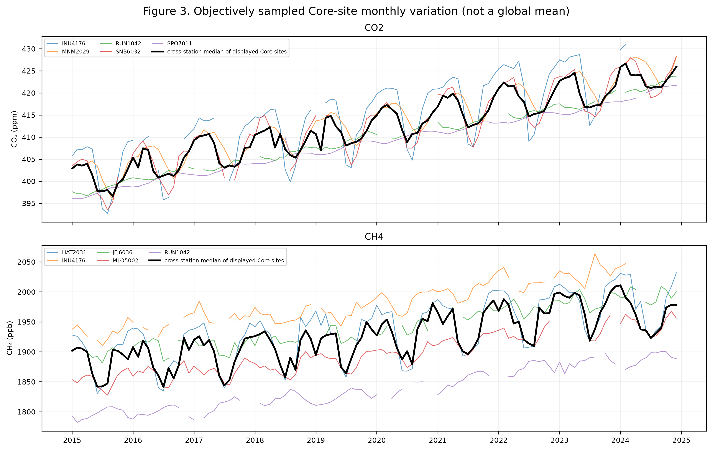
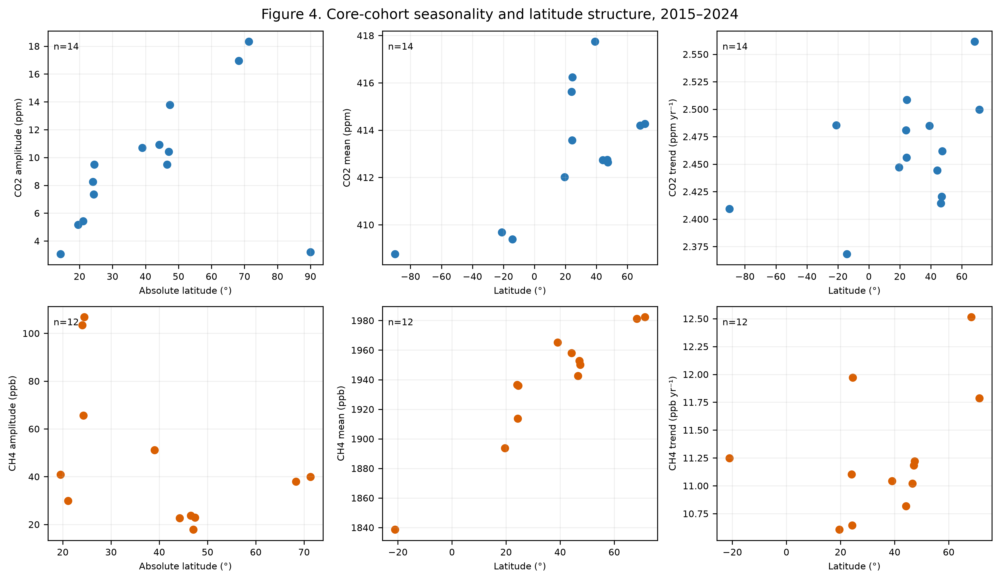
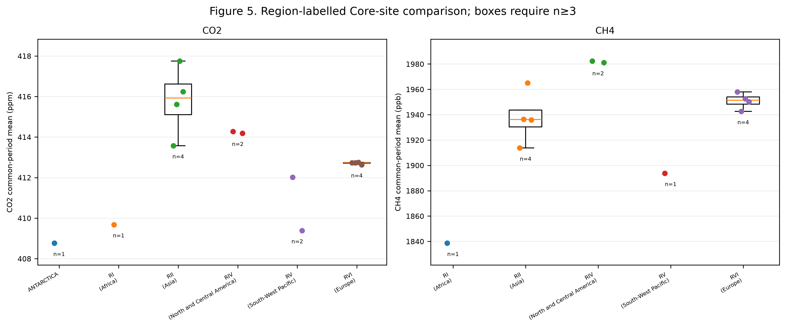

# WDCGG Data Pipeline

This repository contains the reproducible computational workflow developed for a multi-station analysis of long-term atmospheric CO2 and CH4 observations from the World Data Centre for Greenhouse Gases (WDCGG). The workflow covers catalogue screening, acquisition, metadata and contributor validation, quality control, completeness-based cohort construction, validation experiments, scientific analysis and figure generation.

## Research motivation

WDCGG brings together long-term observations contributed by stations and organisations worldwide. Multi-site analysis requires more than downloading files: metadata, contributor validity, temporal completeness, heterogeneous coverage, missingness, anomaly review and provenance must be handled consistently before records can be compared.

## Study overview

The study uses hourly in-situ CO2 and CH4 products available through WDCGG/WMO-GAW. A deterministic workflow records source identities and hashes, interprets contributor quality-control levels, applies predefined completeness rules, and produces traceable time-series, seasonal, spatial and sensitivity analyses.

## Dataset scale

| Quantity | Verified value |
|---|---:|
| Station–gas products screened | 362 |
| Official files acquired | 38 |
| Monitoring stations represented | 23 |
| Total parsed observations | 7,415,318 |
| Contributor-valid observations | 6,562,387 |
| Core station–gas datasets | 26 |
| Core stations | 14 |

The Core cohort contains 14 CO2 datasets and 12 CH4 datasets from 14 stations, including 12 paired stations across six WMO regions. The Extended cohort contains 29 station–gas datasets from 16 stations across all seven WMO regions.

## Methodology

1. Screen the WDCGG catalogue and station–gas metadata.
2. Acquire official files and preserve source identities and SHA-256 hashes.
3. Parse variable-order headers and harmonise UTC timestamps and units.
4. Retain WDCGG level-1 and level-2 contributor-valid observations.
5. Apply the predefined 75/75 Core and 75/60 Extended completeness rules.
6. Evaluate anomaly detectors across controlled perturbations: 600 detector-level evaluations.
7. Evaluate gap-reconstruction methods across gases and gap lengths: 455 method-level evaluations.
8. Calculate time-series, seasonal, trend, latitude, regional and paired-gas summaries.
9. Generate figures and machine-readable provenance outputs.

Statistical anomaly detection and gap reconstruction were not uniformly reliable across conditions. Provider-QC-qualified observed values therefore remained the primary analytical basis. Statistical flags are review annotations, not automatic deletion rules; bounded one-hour reconstruction is reported only as a sensitivity analysis.

## Repository structure

```text
wdcgg-data-pipeline/
├── README.md
├── LICENSE
├── CITATION.cff
├── pyproject.toml
├── requirements.txt
├── src/wdcgg_pipeline/
├── scripts/
├── configs/
├── tests/
├── data/
│   ├── examples/
│   └── manifests/
├── results/
├── provenance/
└── docs/
    ├── DATA_AVAILABILITY.md
    ├── REPRODUCIBILITY.md
    └── figures/
```

## Installation

Python 3.11 or later is recommended.

```bash
python -m venv .venv
python -m pip install --upgrade pip
python -m pip install -e .
python -m pytest -q
```

## Reproducibility

The complete frozen reproduction requires the 38 WDCGG archives listed in `provenance/DOWNLOAD_MANIFEST_V2.csv`. Raw archives are not included.

```bash
python scripts/reproduce_global_cohort_v2.py \
  --mode frozen \
  --data-root /path/to/wdcgg_archives \
  --output-dir reproduction_output \
  --verify-against-freeze
```

Omit `--skip-validation-experiments` to run the complete 600-row anomaly and 455-row reconstruction evaluations. Fresh provider acquisition is available separately, but a current provider version is not an exact reproduction of the frozen study:

```bash
python scripts/reproduce_global_cohort_v2.py \
  --mode reacquire \
  --output-dir fresh_output
```

See [docs/REPRODUCIBILITY.md](docs/REPRODUCIBILITY.md) for stage descriptions and expected outputs.

## Selected results

### Station distribution and monthly-valid coverage



The predefined completeness rules produce a geographically distributed Core cohort and a broader Extended sensitivity cohort.

### Representative long-term observations



Representative 2015–2024 CO2 and CH4 records are shown after contributor-valid QC and cohort selection.

### Spatial and regional summaries





## Publication

Han Che, Hanyue Zheng, Lei Han. “Data-Driven Pipeline for Acquisition, Quality Control and Visual Analysis of Long-term Observations from the WDCGG Database.” Submitted to DSIT 2026; under peer review.

The manuscript is not included in this repository while the submission is under review.

## Authors and contributions

**Han Che** initiated the initial study concept, designed and implemented the core computational workflow, conducted the core experiments, and prepared the first manuscript draft. The methodology, experimental design, scientific interpretation and manuscript were subsequently refined collaboratively with Hanyue Zheng and Lei Han.

## Data availability

WDCGG raw observations are not redistributed here. Obtain data from the [official WDCGG website](https://gaw.kishou.go.jp/) and follow the provider terms and attribution requirements. The repository contains source manifests, public metadata snapshots and synthetic fixtures, but not observation archives.

## License

The source code is released under the MIT License. This license does not apply to WDCGG observations, third-party metadata, Natural Earth geometry or other externally sourced material; those remain subject to their original terms. See [docs/DATA_AVAILABILITY.md](docs/DATA_AVAILABILITY.md).
