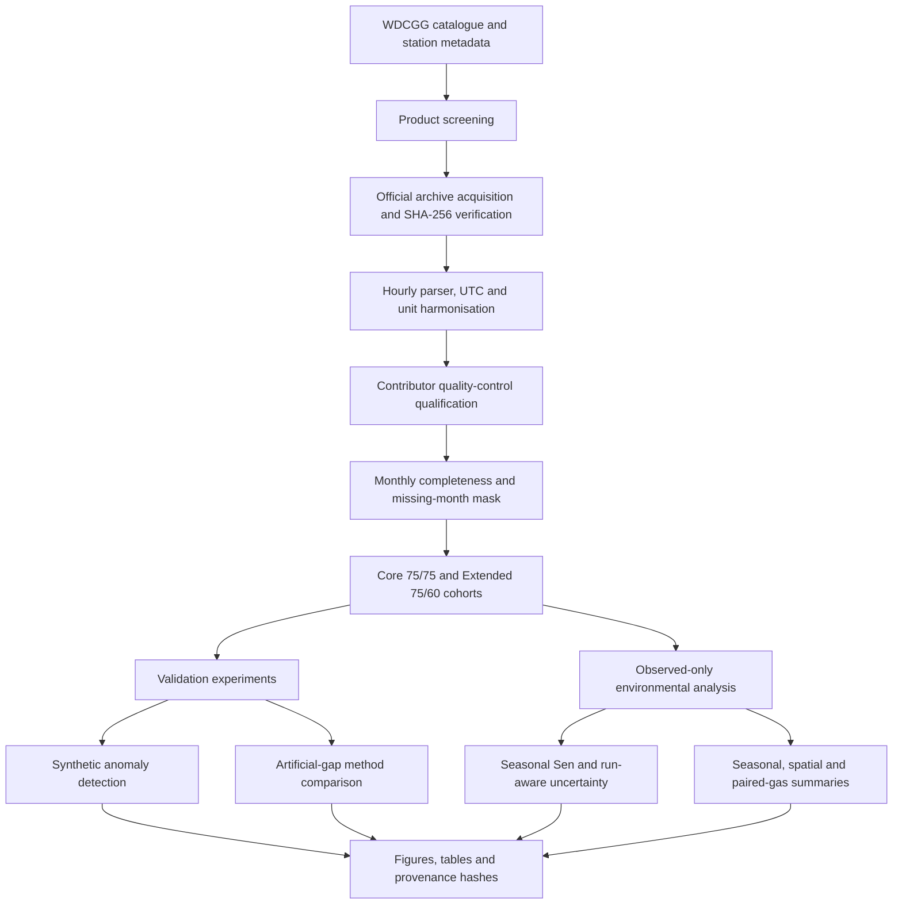

# Scientific workflow architecture

The package separates immutable source observations, deterministic processing, validation experiments, and observed-only environmental summaries. Frozen source identities and tracked public files have recorded hashes; generated outputs retain their source and configuration context. A current WDCGG download is not automatically interchangeable with the frozen source version used for the study.

## Data and inference boundaries

The acquisition layer verifies archives listed in `provenance/DOWNLOAD_MANIFEST_V2.csv`. The parser reads variable-order WDCGG text records, aligns timestamps to UTC, applies documented unit conversion, and preserves source metadata. Contributor QC qualifies observed concentration values for primary aggregation. Within-month coverage is based on contributor-valid hourly counts divided by expected UTC hours; unobserved months remain explicit missing months. Core and Extended membership then use fixed station-level fractions over the 2015–2024 target period.

Synthetic anomaly injections and artificial gaps are validation designs. Detector flags are review annotations, not proof that a real value is invalid and not an automatic deletion rule. Gap reconstructions compare methods on withheld observed values; they do not authorize imputation throughout the environmental series. Primary environmental analyses continue to use observed, contributor-valid values only.

The primary trend point estimator is pooled same-calendar-month Seasonal Sen on qualified monthly means. Station uncertainty uses a run-aware residual moving-block bootstrap; source blocks are contiguous in calendar time and the destination qualification mask is preserved. Selected-Core cohort uncertainty resamples physical stations and uses mean-centered station temporal errors. The 12-month block is primary; 6- and 24-month lengths are sensitivity checks. These intervals describe the selected non-random cohort, not a global atmosphere-wide average.

## Repository roles

- `src/wdcgg_pipeline/` contains scientific implementation and provenance utilities.
- `scripts/` contains explicit entry points; outputs go under the supplied output directory.
- `configs/` records frozen design parameters and seed rules.
- `tests/` uses synthetic fixtures for offline checks; raw-data regression is separate.
- `data/examples/` contains synthetic parser fixtures, never real WDCGG observations.
- `results/frozen/` contains compact final summary tables, not raw or large replicate registries.
- `provenance/` records archive identities, source hashes, and the public release manifest.

See [Methods implementation](METHODS_IMPLEMENTATION.md) for method-to-code locations, [Reproducibility](REPRODUCIBILITY.md) for commands, and [Data availability](DATA_AVAILABILITY.md) for provider terms.
